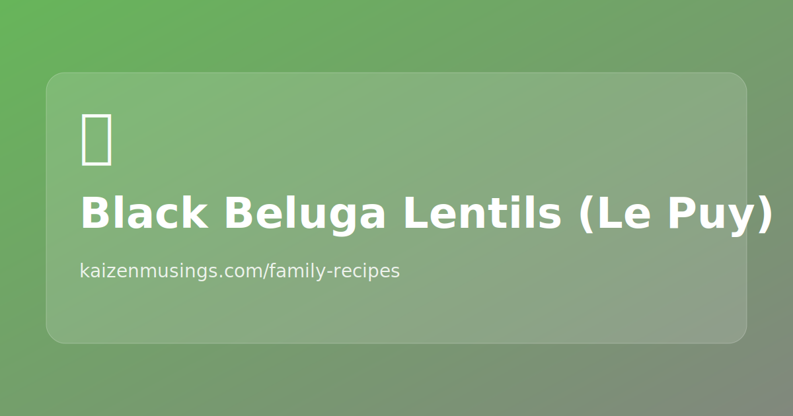

## Steps

1. Boil lentils ~10 minutes, then discard that water.
2. Sauté onion, carrot, garlic, and sweet red pepper in olive oil.
3. Add grated tomatoes; stir.
4. Add lentils.
5. Simmer on low heat ~45 minutes, checking water level.

## Notes

- Source note emphasized: vegetarian, no broth.
