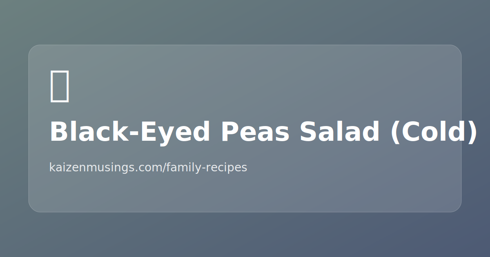

## Steps

1. Boil peas, discard the first dark water.
2. Add fresh water + a bit of salt and boil until cooked.
3. Keep a little cooking water in the pot (don’t drain completely).
4. Let cool, then add parsley + green onions.
5. Dress with olive oil + apple vinegar.

## Notes

- Don’t add onions early.
- Don’t add the oil/vinegar dressing until cooled.
