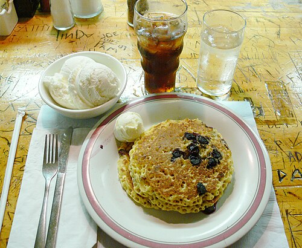

<!-- RECIPE_PHOTO_START -->

<!-- RECIPE_PHOTO_END -->

<!-- GENERATED_RECIPE_METADATA_START -->
## Recipe details

- **Difficulty:** easy
- **Total time:** 20 min
- **Servings:** 3
- **Tags:** breakfast, kid-friendly

## Ingredients

- 1 egg
- 1 cup flour
- 1 cup milk
- 2 tbsp melted butter
- 1/2 tbsp sugar
- 1 tsp baking powder ("1 pack")
- pinch of salt
- a squeeze of lemon (into the baking powder)
- 1 cup blueberries

<!-- GENERATED_RECIPE_METADATA_END -->

## Steps

1. Mix batter ingredients.
2. Add a squeeze of lemon into the baking powder.
3. Cook pancakes over **medium heat**.

## Notes

- Source note: yields ~9 pancakes.
