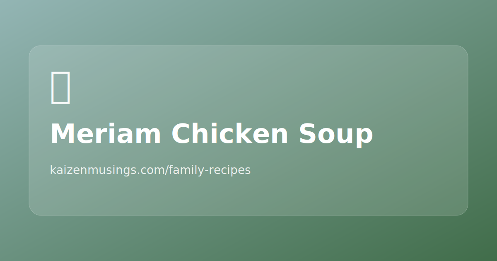

<!-- GENERATED_RECIPE_METADATA_START -->
## Recipe details

- **Difficulty:** easy
- **Total time:** 60 min
- **Servings:** 6
- **Tags:** soup, chicken, pressure-cooker, family

## Ingredients

- 3 chicken carcasses (cleaned; no skin/fat)
- 1 big onion (cut in half)
- 2 carrots (peeled)
- 2 leeks (cut into 3)
- ginger (2 thumb-size pieces)
- 1 whole garlic (peeled)
- 2 tsp salt
- water (~0.5 L, to the pressure cooker mark)

<!-- GENERATED_RECIPE_METADATA_END -->

## Steps

1. Add everything to the pressure cooker with water (to the marked level).
2. Pressure cook ~30 minutes.
3. Remove the onion, carrots, **2 pieces of leek (white part)**, and **1 piece ginger**.
4. Blend those vegetables with some broth until smooth.
5. Stir the remaining broth with bones well to extract flavor, then strain.
6. Combine strained broth with the blended vegetable base; stir and serve.

## Notes

- This ends up as a smooth, rich soup base.
