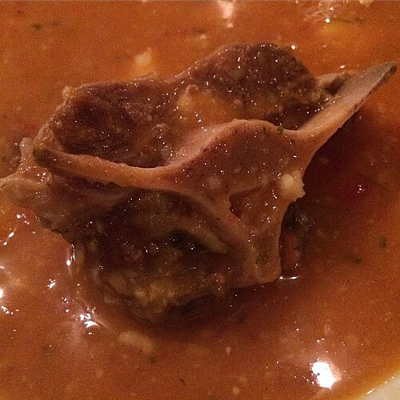

<!-- RECIPE_PHOTO_START -->

<!-- RECIPE_PHOTO_END -->

<!-- GENERATED_RECIPE_METADATA_START -->
## Recipe details

- **Difficulty:** medium
- **Tags:** soup, stew

## Ingredients

- oxtail (rabo de vaca) or toro

<!-- GENERATED_RECIPE_METADATA_END -->

## Steps

1. TODO: add full recipe.

## Notes

- Placeholder from the original cookbook note.
