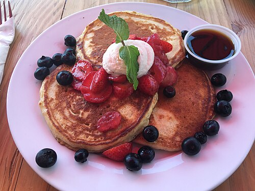

<!-- GENERATED_RECIPE_METADATA_START -->
## Recipe details

- **Difficulty:** easy
- **Total time:** 20 min
- **Servings:** 3
- **Tags:** breakfast, kid-friendly

## Ingredients

- 1 egg
- 1 cup flour
- 1 cup milk
- 2 tbsp melted butter
- 1/2 tbsp sugar
- 1 tsp baking powder
- pinch of salt (optional)
- add-ins: blueberries / banana / walnuts / cinnamon / raisins

<!-- GENERATED_RECIPE_METADATA_END -->

<!-- RECIPE_PHOTO_START -->

<!-- RECIPE_PHOTO_END -->

## Steps

1. Mix egg + flour + milk + melted butter + sugar + baking powder (+ salt).
2. Heat pan; lightly grease if needed. (Test: a few drops of water should sizzle.)
3. Pour ~3 tbsp batter per pancake.
4. Add-ins:
   - blueberries: drop 2–3 into each pancake while cooking
   - banana + walnut + cinnamon
   - raisins + walnuts + cinnamon

## Notes

- Avoid strawberries (note: “too sour”).

## Blueberry pancakes (version 2)

- Same base, plus: squeeze a bit of lemon into the baking powder.
- Add ~1 cup blueberries (makes ~9 pancakes).
