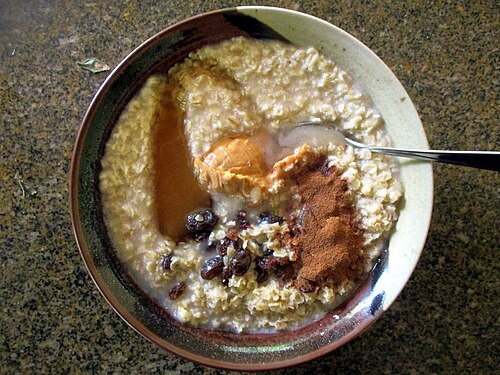

<!-- RECIPE_PHOTO_START -->

<!-- RECIPE_PHOTO_END -->

<!-- GENERATED_RECIPE_METADATA_START -->
## Recipe details

- **Difficulty:** easy
- **Total time:** 15 min
- **Servings:** 2
- **Tags:** breakfast, kid-friendly

## Ingredients

- porridge oats (or preferred base)
- apple (to cook with)
- fruits/toppings:
- Mimi: mango, walnut, almonds
- Lidya: mango, blueberries, walnut, grated almonds / almond powder

<!-- GENERATED_RECIPE_METADATA_END -->

## Steps

1. Cook porridge with apple.
2. Add toppings per kid.
