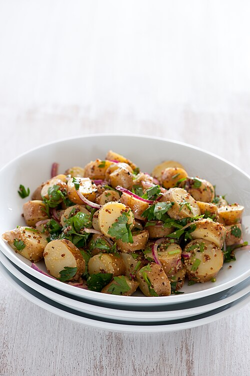

<!-- RECIPE_PHOTO_START -->

<!-- RECIPE_PHOTO_END -->

<!-- GENERATED_RECIPE_METADATA_START -->
## Recipe details

- **Difficulty:** easy
- **Total time:** 35 min
- **Servings:** 6
- **Tags:** salad, make-ahead

## Ingredients

- potatoes
- green onions
- (dressing not specified)

<!-- GENERATED_RECIPE_METADATA_END -->

## Steps

1. Boil potatoes until tender.
2. Cut into cubes (not too small).
3. Chop green onions.

## Notes

- Source note: keep green onions separate and mix later (at night).
- Dressing/seasoning TBD.
