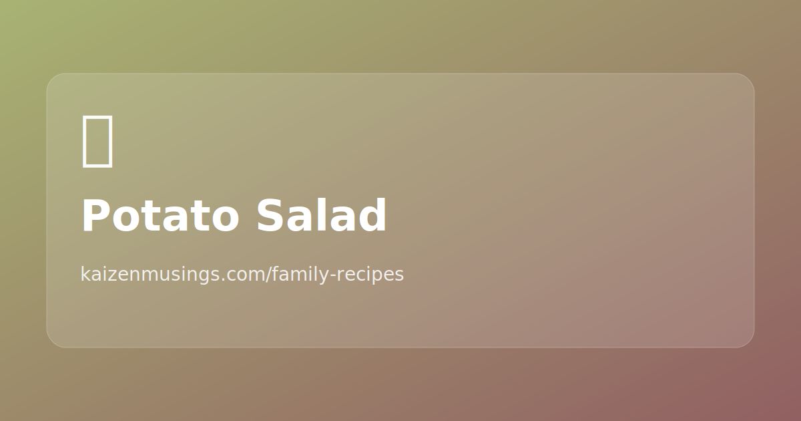

## Steps

1. Boil potatoes until tender.
2. Cut into cubes (not too small).
3. Chop green onions.

## Notes

- Source note: keep green onions separate and mix later (at night).
- Dressing/seasoning TBD.
