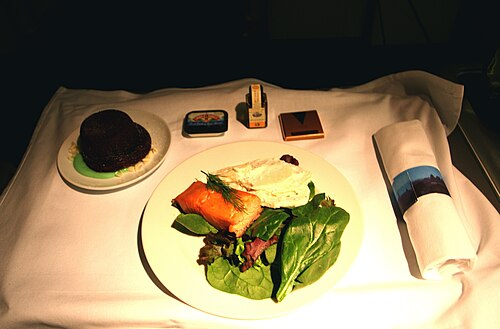

<!-- RECIPE_PHOTO_START -->

<!-- RECIPE_PHOTO_END -->

<!-- GENERATED_RECIPE_METADATA_START -->
## Recipe details

- **Dish type:** protein
- **Cuisine:** Family
- **Difficulty:** easy
- **Total time:** 40 min
- **Servings:** 2
- **Tags:** weeknight, fish, family

## Ingredients

- salmon fillets
- olive oil
- salt
- black pepper
- lemon

<!-- GENERATED_RECIPE_METADATA_END -->

## Steps

1. Pat salmon fillets dry and season with salt and pepper.
2. Sear in olive oil skin-side down over medium-high heat, 4–5 minutes until the skin is crisp.
3. Flip and cook 2–3 minutes more, depending on thickness.
4. Finish with lemon. Serve with rice or potato salad and a green salad.

## Notes

- Placeholder details to be filled in with the family's usual preparation.
- Pairs with potato salad or roast potatoes as the carb.