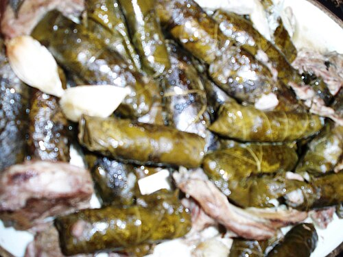

<!-- RECIPE_PHOTO_START -->

<!-- RECIPE_PHOTO_END -->

<!-- GENERATED_RECIPE_METADATA_START -->
## Recipe details

- **Cuisine:** Turkish
- **Difficulty:** medium
- **Total time:** 80 min
- **Servings:** 6
- **Tags:** turkish, stuffed, family

## Ingredients

- vine leaves
- 500 g ground beef
- 2 tbsp rice
- 1 onion, finely grated
- parsley, finely chopped
- 2 large tomatoes, grated
- olive oil
- black pepper
- salt
- ~1 cup water (for cooking)

<!-- GENERATED_RECIPE_METADATA_END -->

## Steps

1. Dip vine leaves in hot water ~30 seconds to remove excess salt.
2. Mix filling: ground beef + rice + onion + parsley + salt/pepper + olive oil + grated tomatoes.
3. Roll dolma and pack tightly in the pot.
4. Place a plate on top to keep them in place.
5. Add ~1 cup water.
6. Bring to a boil, then switch to low heat and cook until done.

## Notes

- The tight packing + plate are key so they don’t unravel.
