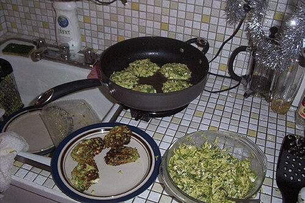

<!-- GENERATED_RECIPE_METADATA_START -->
## Recipe details

- **Cuisine:** Turkish
- **Difficulty:** easy
- **Total time:** 30 min
- **Servings:** 4
- **Tags:** vegetarian, fritters, weeknight

## Ingredients

- 3 medium zucchini (~450 g), shredded
- salt
- black pepper
- 3 large eggs, beaten
- 1/2 cup all-purpose flour
- 1 tbsp extra virgin olive oil
- 1 cup crumbled feta
- 3 scallions, finely chopped
- 1/3 cup dill, finely chopped
- 1 tsp baking powder
- 4–6 tbsp vegetable oil (for frying)
- 2/3 cup plain yogurt (sauce)
- 2 cloves garlic, finely chopped (sauce)

<!-- GENERATED_RECIPE_METADATA_END -->

<!-- RECIPE_PHOTO_START -->

<!-- RECIPE_PHOTO_END -->

## Steps

1. Preheat oven to **120°C / 250°F** to keep pancakes warm.
2. Salt shredded zucchini (about 1/2 tsp) in a colander; drain 5 min.
3. Wrap in a towel and squeeze hard (twice) to remove as much water as possible.
4. Mix zucchini + eggs. Add flour, olive oil, feta, scallions, dill, pepper, and a bit more salt.
5. Mix in baking powder.
6. Fry: heat 2 tbsp vegetable oil in a heavy skillet over medium heat.
7. Drop heaping tablespoons of batter, flatten to ~1 cm thickness.
8. Fry until golden both sides (total ~5–6 min). Drain on paper towels; keep warm in oven.
9. Sauce: mix yogurt + garlic + salt.

## Notes

- The key is squeezing the zucchini dry so they stay crisp.
